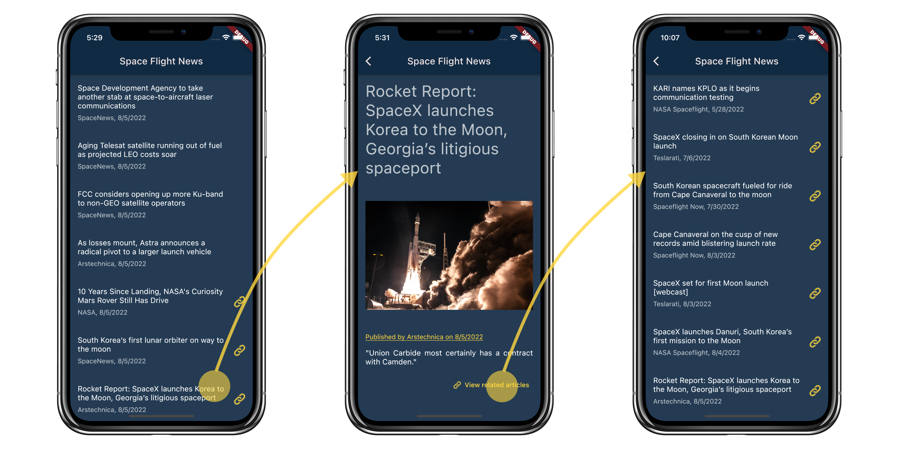

# Space Flight News app

Source code of the mobile application that displays a list of recent space-flight related news obtained from [Spaceflight News API](https://thespacedevs.com/snapi). Created with [Flutter](https://flutter.dev/).

It demonstrates the usage of various code generating packages.

# Flutter Vikings 2022

This repository complements the "Fun with code generation" talk by [Anna Leushchenko](https://github.com/foxanna) at the [Flutter Vikings](https://fluttervikings.com/) conference on the August 31, 2022. [Slides](assets/slides.pdf) are included.

